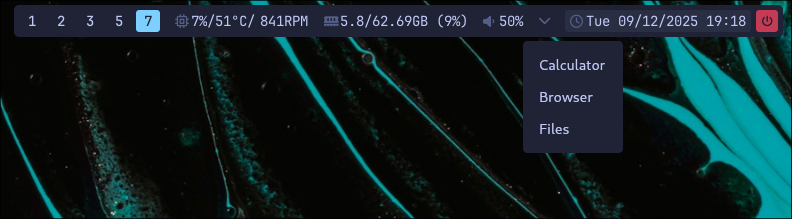

# waybox
Waybox is a minimal, configurable launcher menu designed to be triggered from Waybar or any external command.

It reads a simple XML configuration file and displays a clean, single-level menu where each item launches an application or command.  
Fully self-contained Flutter binary with Wayland layer-shell support.

## Preview
  

## Features
- Configurable single-level menu via `waybox.xml`.
- Customizable colors, window size and coordinates via `options.conf`.
- Launch applications using plain Bash commands.
- Auto-close when the cursor leaves the window.
- Native Wayland layer-shell integration.

## Requirements
- Linux (with Wayland)
- Flutter 3.35.7 or later (stable) only for building from source.

## Installation
### RPM package (recommended)
```bash
sudo dnf install waybox-1.0.0-x86_64.rpm
```

### From source
```bash
git clone https://github.com/ifgar/waybox.git
cd waybox
flutter pub get
flutter build linux --release
./build/linux/x64/release/bundle/waybox
```

### Hyprland note
Hyprland applies animations to layer-shell surfaces by default. If this rule is not added, Waybox will first appear centered on the screen and then slide to the user-defined coordinates, which is undesirable.

To disable this behavior, add the following to your `hyprland.conf`:

```
layerrule = noanim, waybox
```


## Configuration
Waybox stores user-editable configuration files in:
```
~/.config/waybox/
```
Files:
- **waybox.xml** — defines the menu items  .
- **options.conf** — defines window size, position and colors.

These files are automatically created on first launch if missing. 
You can edit them at any time without rebuilding the app.
### Edit configuration
```bash
nano ~/.config/waybox/waybox.xml
nano ~/.config/waybox/options.conf
```

## Usage
Waybox is typically launched from Waybar or any scriptable launcher.

### Example Waybar module
```json
  "custom/waybox": {
    "format": "",
    "on-click": "waybox",
    "tooltip": false
  },
```

Waybox reloads its configuration on every launch.

## Example configuration
### `waybox.xml`
```xml
<menu name="root">
  <menu name="Calculator" command="gnome-calculator" />
  <menu name="Browser" command="firefox" />
  <menu name="Files" command="thunar" />
</menu>
```

### `options.conf`
```ini
[size]
width=300
height=220
x=100
y=100

[theme]
text=#FFFFFF
hover=#222222
background=#000000
```
#### Field reference
- **width / height**: window size in pixels.  
- **x / y**: absolute screen position where the window will appear.
- **text**: text color in hex format.  
- **hover**: background color when hovering an item.  
- **background**: window background color.

#### Notes
- Missing values fall back to internal defaults.  
- Changes apply on the next launch.  
- **Hyprland:** without `layerrule = noanim, waybox` the window will first spawn centered and then “jump” to `(x, y)`, which is undesirable.

## Screenshot


## License
This project is licensed under the MIT License. See the `LICENSE` file for details.