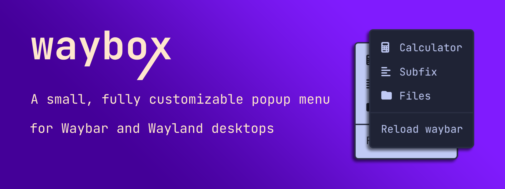
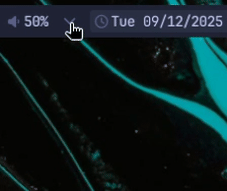

# waybox
Waybox is a minimal, configurable launcher menu designed to be triggered from Waybar or any external command.

It reads a simple XML configuration file and displays a clean, single-level menu where each item launches an application or command.  
Fully self-contained Flutter binary with Wayland layer-shell support.

## Preview
  

## Features
- Configurable single-level menu via `waybox.xml`.
- Customizable appearance via `theme.conf`.
- CLI arguments for menu selection and positioning (`--menu`, `--x`, `--y`).
- Launch applications using plain Bash commands.
- Native Wayland layer-shell integration.

## Requirements
- Linux (with Wayland)
- Flutter 3.35.7 or later (stable) only for building from source.

## Installation
### RPM package (recommended)
```bash
sudo dnf install waybox-1.1.0-x86_64.rpm
```

### From source
```bash
git clone https://github.com/ifgar/waybox.git
cd waybox
flutter pub get
flutter build linux --release
./build/linux/x64/release/bundle/waybox
```


## Configuration
Waybox stores user-editable configuration files in:
```
~/.config/waybox/
```

These files are automatically created on first launch if missing. 
You can edit them at any time without rebuilding the app.  
`waybox.xml` defines the menu items while `theme.conf` defines window and items appearance.


### Configuration files
### `waybox.xml`
```xml
<menu name="root">
  <menu name="Calculator" command="gnome-calculator" />
  <menu name="Browser" command="firefox" />
  <menu name="separator-space" />
  <menu name="Files" command="thunar" />
</menu>
```

Each `<menu>` entry represents a single row in the menu.

- Entries **with `command`** launch the specified command when clicked.
- Entries **without `command`** are rendered as text-only items and do not launch anything.
- Some text-only entries are **special reserved names** that render visual separators instead of text, see below.

### Separators
| option                  | description                                                    |
| ----------------------- | -------------------------------------------------------------- |
| `separator-space`       | Empty vertical spacer with a fixed height of 8px.             |
| `separator-line`        | Full-width horizontal divider that touches the window borders. |
| `separator-line-short`  | Horizontal divider with 8px padding on each side.             |

### `theme.conf`
```ini
[menu]
background= #1F2335
borderRadius= 4
border= #7DCFFF
borderWidth= 0

[item]
text= #C0CAF5
fontFamily=
fontSize=
hover= #292E42
hoverText= #7DCFFF

[separator]
color= #292E42
thickness= 1
```

### Field reference
| option         | typeof  | default   | description                           |
| -------------- | ------- | --------- | ------------------------------------- |
| `background`   | color   | `#000000` | Window background color.              |
| `borderRadius` | integer | `4`       | Window border radius.                 |
| `border`       | color   | `#202020` | Window border color.                  |
| `borderWidth`  | integer | `0`       | Window border width. Set to `0` to disable the border. |
| `text`         | color   | `#FFFFFF` | Item text color.                      |
| `fontFamily`   | string  |           | Item text font family.                |
| `fontSize`     | integer | `14`      | Item text font size.                  |
| `hover`        | color   | `#222222` | Item background color while hovering. |
| `hoverText`    | color   | `#FFFFFF` | Item text color while hovering.       |
| `color`        | color   | `#2C2C2C` | Separator color.                      |
| `thickness`    | integer | `1`       | Separator thickness.                  |


### Notes
- Missing values fall back to internal defaults.  
- Changes apply on the next launch.  
- **Hyprland:** To disable the slight fade-in / fade-out animation when launching Waybox, add `layerrule = noanim, waybox` to your `hyprland.conf`. 


## Usage
Waybox is typically launched from Waybar or any scriptable launcher.

### Example Waybar module
```json
  "custom/waybox": {
    "format": "",
    "on-click": "waybox --x 1820 --y 4",
    "tooltip": false
  },
```

Waybox reloads its configuration on every launch.  
`--x` and `--y` define the coordinates in which waybox will appear.

### Multiple instances
You can have as many instances of waybox as you desire. Just specify a different XML file with `--menu`
```json
  "custom/waybox1": {
    "format": "",
    "on-click": "waybox --x 1820 --y 4",
    "tooltip": false
  },

  "custom/waybox2": {
    "format": "",
    "on-click": "waybox --menu waybox2.xml --x 1720 --y 4",
    "tooltip": false
  },
```
Defaults to `waybox.xml` when `--menu` is omitted.


## License
This project is licensed under the MIT License. See the `LICENSE` file for details.